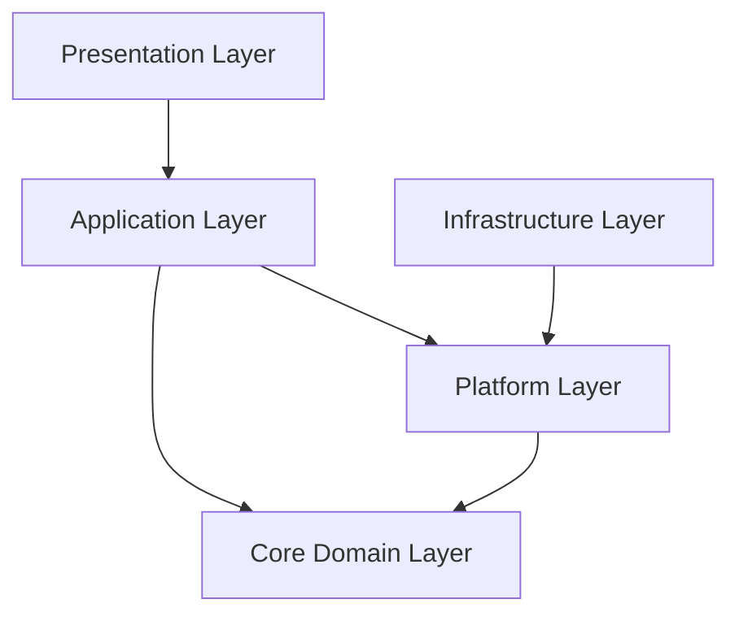

# Architecture Overview

GoForms follows Clean Architecture principles to maintain a clear separation of concerns and dependencies. This document outlines the architectural decisions and patterns used in the project.

## Architectural Layers

### 1. Core Domain Layer (`/internal/core/`)

The heart of the application, containing business logic and domain rules.

#### Key Components:
- **Contact Domain**
  ```go
  /internal/core/contact/
  ├── model.go       // Domain entities and types
  ├── service.go     // Business operations
  ├── store.go       // Storage interface
  └── errors.go      // Domain-specific errors
  ```

- **Subscription Domain**
  ```go
  /internal/core/subscription/
  ├── model.go       // Domain entities and types
  ├── service.go     // Business operations
  ├── store.go       // Storage interface
  └── errors.go      // Domain-specific errors
  ```

#### Characteristics:
- Pure business logic
- No external dependencies
- Defines interfaces for external requirements
- Contains domain models and business rules
- Framework-independent

### 2. Platform Layer (`/internal/platform/`)

Implements technical concerns and infrastructure.

#### Key Components:
- **Database**
  ```go
  /internal/platform/database/
  ├── migrations/    // Database schema changes
  ├── stores/       // Implementation of core interfaces
  └── connection.go // Database connection management
  ```

- **Error Handling**
  ```go
  /internal/platform/errors/
  ├── errors.go     // Error types and handling
  └── middleware.go // Error middleware
  ```

- **Server**
  ```go
  /internal/platform/server/
  ├── config.go     // Server configuration
  └── server.go     // HTTP server setup
  ```

#### Characteristics:
- Implements interfaces defined in core
- Handles technical details
- Contains external dependencies
- Provides concrete implementations

## Dependency Flow



## Key Design Decisions

### 1. Interface Segregation
- Small, focused interfaces in core
- Concrete implementations in platform
- Example:
  ```go
  // Core interface
  type Store interface {
      Create(ctx context.Context, entity *Entity) error
      Get(ctx context.Context, id string) (*Entity, error)
  }

  // Platform implementation
  type SQLStore struct {
      db *sqlx.DB
  }
  ```

### 2. Dependency Injection
- Using Uber FX for DI
- Modules provide their dependencies
- Example:
  ```go
  func NewModule() fx.Option {
      return fx.Options(
          fx.Provide(
              NewService,
              NewStore,
          ),
      )
  }
  ```

### 3. Error Handling
- Domain-specific errors in core
- Technical errors in platform
- Error translation at boundaries
- Example:
  ```go
  // Core error
  var ErrNotFound = errors.New("entity not found")

  // Platform error handling
  func (s *SQLStore) handleError(err error) error {
      if errors.Is(err, sql.ErrNoRows) {
          return ErrNotFound
      }
      return err
  }
  ```

## Testing Strategy

### Core Layer
- Pure unit tests
- Mock interfaces
- No external dependencies
- Example:
  ```go
  func TestService_Create(t *testing.T) {
      mockStore := mocks.NewMockStore()
      service := NewService(mockStore)
      // Test business logic
  }
  ```

### Platform Layer
- Integration tests
- Real dependencies
- Infrastructure testing
- Example:
  ```go
  func TestSQLStore_Create(t *testing.T) {
      db := setupTestDB(t)
      store := NewSQLStore(db)
      // Test with real database
  }
  ```

## Future Considerations

1. **Scalability**
   - Microservices split along domain boundaries
   - Independent scaling of components
   - Message queue integration

2. **Monitoring**
   - Metrics collection in platform layer
   - Business metrics in core
   - Distributed tracing

3. **Security**
   - Authentication/Authorization in platform
   - Business rules in core
   - Rate limiting and API security
